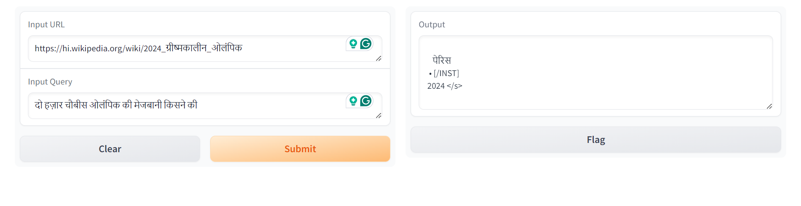

# LangChain

## LangChain_SarvamAI2B_Demo.ipynb

This project showcases the use of [LangChain](https://www.langchain.com) with the [Sarvam AI 2B-v0.5](https://huggingface.co/sarvamai/sarvam-2b-v0.5) LLM to build a Retrieval-Augmented Generation (RAG) application that fetches URLs, creates embeddings using [Google BERT multilingual uncased](https://huggingface.co/google-bert/bert-base-multilingual-uncased), and responds to user queries based on these embeddings.

### Overview

This application allows users to ask questions and receive answers based on information retrieved from a set of URLs. The process involves:

1. **Fetching URLs:** The application retrieves relevant URLs based on the user's query.
2. **Creating Embeddings:** The content from the fetched URLs is converted into embeddings after being converted into smaller chunks using Google BERT multilingual uncased. Embeddings are numerical representations of text that capture the semantic meaning of the content.
3. **Responding to Queries:** The application uses the embeddings to find the most relevant information and generates a response to the user's query using the Sarvam AI 2B-v0.5 language model.

## Technologies Used

* **LangChain:** A framework for developing applications powered by language models.
* **Sarvam AI 2B-v0.5:** A powerful language model from Sarvam AI.
* **Google BERT multilingual uncased:** A pre-trained language model used for creating embeddings.

## How to Run

1. **Install Dependencies:** Make sure you have the necessary libraries installed. You can install them using `pip install -r requirements.txt`.
2. **Provide URLs:**  Provide a list of URLs or a method to fetch relevant URLs based on user queries.
3. **Run the Application:** Execute the main script to start the application.

## Dependencies

1. LangChain Core: For document loaders, text splitting, and retrieval chains
2. Gradio: For creating the web interface
3. FAISS: For vector storage and similarity search
4. Google BERT: For generating embeddings
5. Sarvamai 2B Model: For text generation

## Demo Images

The first demo involves using the correct link and querying the LLM, which successfully returns the correct output based on that link.

The second demo demonstrates what happens when an incorrect link is used. In this case, the LLM attempts to provide a response based on its trained data, leading to an incorrect output.

## Disclaimer

The developer is not responsible for any inappropriate data generation. The pretrained models are utilized as-is without any modifications.
